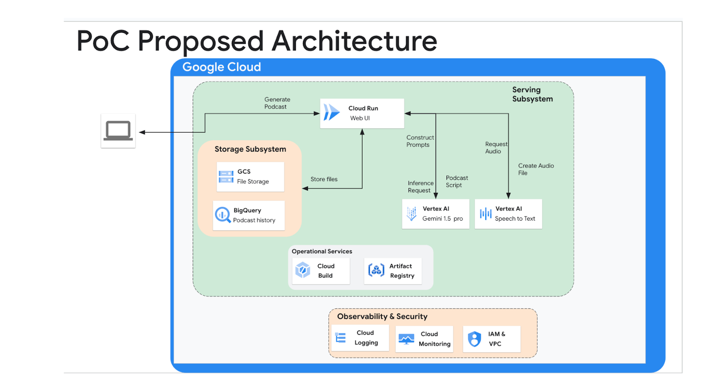
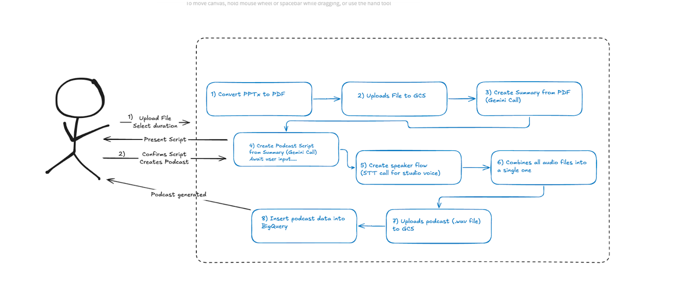

<!--
Copyright 2025 Google LLC
Licensed under the Apache License, Version 2.0 (the "License");
you may not use this file except in compliance with the License.
You may obtain a copy of the License at
     https://www.apache.org/licenses/LICENSE-2.0

Unless required by applicable law or agreed to in writing, software
distributed under the License is distributed on an "AS IS" BASIS,
WITHOUT WARRANTIES OR CONDITIONS OF ANY KIND, either express or implied.
See the License for the specific language governing permissions and
limitations under the License.
-->

# GSK Podcast Generator
## Purpose
This application enables a user to generate podcasts using PDF files as input.
It leverages several Google Cloud services, allowing for a streamlined and scalable podcast creation process.

## High Level Architecture



The architecture is designed with scalability, reliability, and maintainability in mind. It comprises the following key components:

**1. Serving Subsystem:**

* **Cloud Run (Web UI):** Provides a user interface for interacting with the platform. Users can upload documents for podcast generation through this interface.
* **Vertex AI (Gemini 1.5 pro):** A powerful machine learning platform that utilizes Gemini 1.5 pro to process the user prompts and generate podcast scripts.
* **Vertex AI (Speech-to-Text API):** Converts the generated podcast script into audio format.

**2. Storage Subsystem:**

* **GCS (Google Cloud Storage):** Stores the uploaded PDF files, the generated audio files.
* **BigQuery:** Maintains a history of generated podcasts, including metadata.

**3. Operational Services:**

* **Cloud Build:** Enables automated building and deployment of the platform components.
* **Artifact Registry:** Stores container images and other build artifacts.

**4. Observability & Security:**

* **Cloud Logging:** Collects logs from all platform components for monitoring and troubleshooting.
* **Cloud Monitoring:** Provides metrics and alerts for system performance and health.
* **IAM & VPC:** Manages access control and network security for the platform.


## Process Flow


The podcast generation process follows these steps:

1. **File Upload and Duration Selection:** The user uploads a file in PDF format and selects the desired podcast duration via UI.
2. **File Conversion and Storage:** The uploaded file is uploaded to GCS.
3. **Summary Generation:** A summary of the PDF content is created with Vertex AI using Gemini.
4. **Podcast Script Creation:**  A podcast script is generated from the summary. If needed, the user can edit the script directly in the UI.
5. **Speaker Flow Generation (Studio Voice):**  Speaker flow is generated and multiple audio files are generated using an experimental Speech-to-Text (STT) API that allows for multi-speaker audio generation.
6. **Audio Combination:** All generated audio files are combined into a single podcast audio file in WAV format.
7. **Podcast Upload:** The final podcast audio file is uploaded to GCS.
8. **Metadata Storage:** From the UI, the user can save the podcast metadata into BigQuery that becomes available in the podcast history in the UI.

## Deployment
The platform is deployed using Cloud Build, which automates the process of building and deploying the necessary components. Container images are stored in Artifact Registry.

## Observability and Monitoring
As the app is deployed on Cloud Run, it supports the usage of Cloud Logging and Cloud Monitoring to ensure the platform's health and performance. Logs can be collected from all components, and metrics can be monitored for potential issues.

## Security
As the application is a PoC, the service is deployed using unauthenticated access.
For a deployment beyond that of a PoC, access control via Identity and Access Management (IAM), and network security via Virtual Private Cloud (VPC) are recommended.

## Getting Started
This section outlines the steps required to run the application, both locally for development and testing, and on Google Cloud Run for production deployment.

### Prerequisites

Before you begin, ensure you have the following:

*   **Python 3.11:**  The application is designed to run on this version. You can check your Python version by running `python --version` in your terminal.  If you don't have it, download and install it from [python.org](https://www.python.org/).
*   **Google Cloud SDK (gcloud):** This is required for deploying to Cloud Run.  Download and install it following the instructions on the [Google Cloud documentation](https://cloud.google.com/sdk/docs/install). After installation, configure gcloud by running `gcloud init` and selecting your project.
*   **A Google Cloud Project:** A Google Cloud Project is required to use GCP services. You can create a project in the [Google Cloud Console](https://console.cloud.google.com/).
*   **A Google Cloud Storage Bucket:**  To store the generated audio and temporary files, a Cloud Storage Bucket is needed.
*   **BigQuery Tables:** A BigQuery Table is needed to store the metadata of the created podcasts. The table will be automatically created, if not already present, by the application.

### Google Cloud Configuration (gcp_config.toml)
There are different configuration files in the application but the only one that is missing is the `gcp_config.toml`. In the repository you can find an `example_gcp_config.toml` that you can use as reference. It should be 
The `gcp_config.toml` file is crucial for configuring the application.  You'll need to populate it with your specific project details and resource names.
In the repository is included an `example_gcp_config.toml` that you can use as reference. You can edit and rename it as `gcp_config.toml`.

Here's an example what the `gcp_config.toml` could look like:

```toml
#------------------------------------------------#
#              Project Configuration             #
#------------------------------------------------#
[project]
project_id = "your-project-id" # required
location = "my-default-location" # required

#------------------------------------------------#
#            Vertex AI Configuration             #
#------------------------------------------------#
[vertex_ai]
project_id = "my-vertex-project-id" # optional
model = "my-gemini-model" # optional
location = "my-vertex-ai-location" # optional

#------------------------------------------------#
#               GCS Configuration                #
#------------------------------------------------#
[gcs]
uri = "gs://my-bucket/my-folder" # required

#------------------------------------------------#
#            BigQuery Configuration              #
#------------------------------------------------#
[bigquery]
project_id = "my-bq-project" # optional
dataset_id = "my_dataset" # optional
table_id = "my_table" # optional
location = "my-bq-location" # optional
```
**Explanation of Configuration Parameters:**

* `project`
    *  `project_id` - **required**: Your Google Cloud Project ID.
    *  `location`- **required**: The Google Cloud region to be used by default.
* `vertex_ai`
    * `project_id`: The Google Cloud Project ID for Vertex AI. If not specified, the value is set to `project.project_id`.
    * `model` - **optional**: The Vertex AI model to use. If not specified, the value is set to `gemini-1.5-pro-002`.
    * `location`: The Google Cloud region for Vertex AI. If not specified, the value is set to `project.location`.
* `gcs`
    * `uri`: The GCS URI path to folder that will be used to store the uploaded PDF files and the generated podcasts audio WAV files.
* `bigquery`
    * `project_id`: The Google Cloud Project ID for BigQuery. If not specified, the value is set to `project.project_id`.
    * `bq_dataset`: The name of the BigQuery dataset. If not specified, the value is set to `podcast`.
    * `bq_table`: The name of the BigQuery table. If not specified, the value is set to `history`.

The GCS bucket referred in the `gcs.uri` parameter should be already created. The sub-folders will be created by the application, if not already present.

Both the BigQuery dataset and table specified in the `bigquery.bq_dataset` and `bigquery.bq_table` parameters will be automatically created by the application.

### Authentication for Local Development

When developing locally and interacting with Google Cloud services (like Cloud Storage or BigQuery), you'll need to authenticate your application using Application Default Credentials (ADC). The easiest way to do this is to use the `gcloud` command-line tool:

```bash
gcloud auth application-default login
```
This command will open a browser window where you can log in with your Google Cloud account.  Once you've authenticated, the ADC will be available to your application.  This step is crucial for local development.

### Local Execution (Python 3.11)


1.  **Navigate to the application directory:**

    ```bash
    cd app/
    ```

2.  **Create a virtual environment:**  This isolates the project's dependencies.

    ```bash
    python -m venv .venv
    ```

3.  **Activate the virtual environment:**

    ```bash
    source .venv/bin/activate
    ```

4.  **Install dependencies:**

    ```bash
    pip install -r requirements.txt
    ```

5.  **Run the Streamlit application:**

    ```bash
    streamlit run Home.py
    ```

    This will start the application, and you can access it in your web browser, usually at `http://localhost:8501`.

### Deployment to Cloud Run

1.  **Navigate to the project root (containing the `app` directory):**

    ```bash
    cd .. # Assuming you are inside the app/ dir.
    ```

2.  **Deploy to Cloud Run:**

    ```bash
    gcloud run deploy my-app --source ./app --region us-central1 --allow-unauthenticated
    ```

    *   Replace `my-app` with your desired service name.
    *   Replace `us-central1` with your desired GCP region.
    *   The `--allow-unauthenticated` flag makes the service publicly accessible.  For production environments, you should configure authentication.

    After successful deployment, Cloud Run will provide you with a URL to access your application.